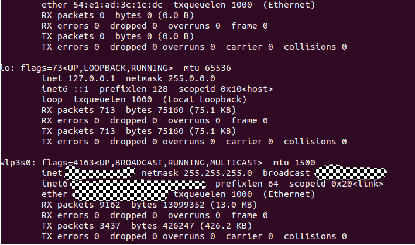

## Step 1
Open terminal and type *ifconfig*.

If command not available type *sudo apt install net-tools* to make sure it is possible to run *ifconfig*.

## Step 2

From the wlp3s0 section from the previous image take the inet address and add to .bashrc as follows.

*export ROS_MASTER_URI=http://wlp3s0_inet:11311*

*export ROS_HOSTNAME=wlp3s0_inet*

Save the .bashrc file and on a terminal type *source ~/.bashrc*.

## Step 3
Download [Ros-Mobile](https://play.google.com/store/apps/details?id=com.schneewittchen.rosandroid) on the phone.

## Step 4
Make sure that the computer and phone are connected to same network and check the phone's IP address.

To do this, access the definitions on the phone. Open the section *About Phone* and then, open the *state* section.

## Step 5
Ping phone from computer and make sure that the connection is being successful.

## Step 6
Run the robot that is to be controlled and check which topic should be receiving the joystick data.

## Step 7
Open the Ros-mobile app and configure the Master to be as follows:
MASTER_URL:*wlp3s0_inet*

Master port:11311

Device IP address:*phone_ip*

## Step 8
Add joystick.

In the Ros-mobile app go to *DETAILS* and press *Add widget* and create widget of type *Joystick*.
Upon creating select the newly-created widget and configure the topic name according to ros that should receive this data.

## Step 9
Control robot.

In the app, after creating the joystick go to *VIZ* and there should be a joystick which allows to control the robot.